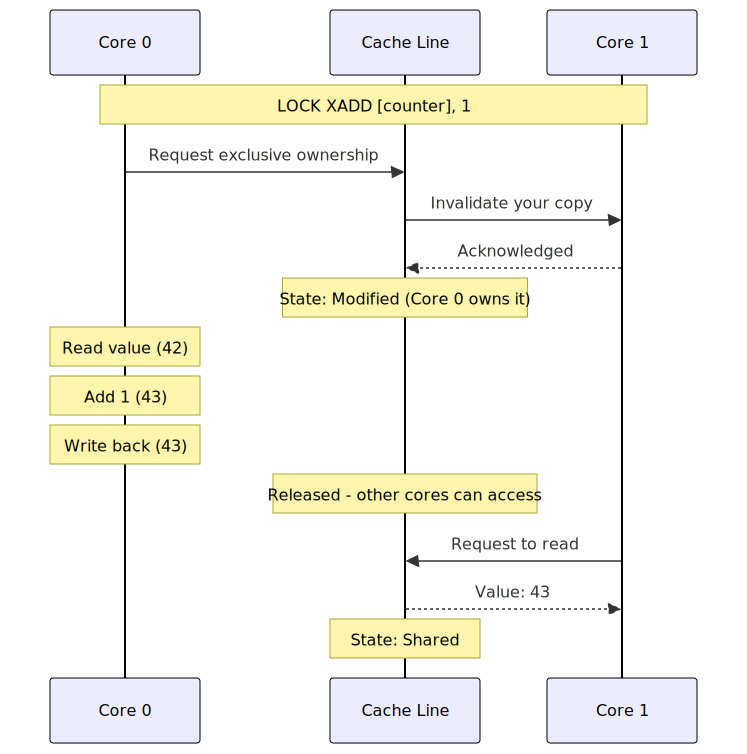

You have a counter. Multiple goroutines increment it. You reach for a mutex.

But a mutex for a single integer? That's like hiring a security guard to protect a light switch.

Atomic operations exist for exactly this case. They're faster, simpler, and built directly into the CPU. But most developers don't understand _how_ they work — which leads to subtle bugs and missed optimizations.

Let's fix that.

## What Makes an Operation "Atomic"?

An operation is atomic if it completes in a single, indivisible step. No other thread can see it half-done.

Consider incrementing a counter:

```go
counter++  // NOT atomic
```

This innocent line is actually three operations:

1. Read `counter` from memory
2. Add 1 to the value
3. Write result back to memory

If two goroutines do this simultaneously:

```
Goroutine 1:  READ(0)  →  ADD(1)  →  WRITE(1)
Goroutine 2:       READ(0)  →  ADD(1)  →  WRITE(1)

Expected: 2
Actual: 1  ← Lost update!
```

Both read 0, both write 1. One increment vanishes.

## How Does the CPU Make Operations Atomic?

Remember the problem: `counter++` is three steps (read, add, write), and another core can interfere between any of them. We need a way to make all three steps happen as one indivisible operation.

CPUs solve this at the hardware level. There are two fundamentally different approaches.

### x86: The LOCK Prefix

On Intel/AMD processors, certain instructions can be prefixed with `LOCK`. This tells the CPU: "I own this cache line until this instruction completes. No other core can read or write it."

```nasm
; Normal increment (NOT atomic — 3 separate operations)
MOV  EAX, [counter]    ; 1. Read counter into register
ADD  EAX, 1            ; 2. Add 1
MOV  [counter], EAX    ; 3. Write back

; Atomic increment (ONE operation, indivisible)
LOCK XADD [counter], 1  ; Read + Add + Write in a single instruction
```

How does `LOCK` actually work? It leverages the cache coherence protocol (MESI).

> **What is MESI?** Each cache line on each core is in one of four states: **Modified** (I changed it, only I have it), **Exclusive** (only I have it, matches RAM), **Shared** (multiple cores have it, read-only), or **Invalid** (stale, don't use). When one core wants to write, it sends a message to all other cores: "invalidate your copy." Only after they confirm does the write proceed. This is how cores stay in sync without a central lock — they negotiate ownership of cache lines through these state transitions.

When a core executes a `LOCK`ed instruction:

1. The core acquires **exclusive ownership** of the cache line containing the address (MESI "Modified" state)
2. While it holds exclusive ownership, no other core can even _read_ that cache line — their requests are queued
3. The core performs the full read-modify-write inside its own cache
4. Only then does it release the cache line, and other cores can access it again

This is not a global bus lock (that was the old, slow approach). Modern CPUs lock only the specific cache line — 64 bytes. Other cores can still access different memory freely. The "lock" is really just the MESI protocol refusing to share that one cache line until the operation completes.

The key x86 atomic instructions:

| Instruction    | What it does                                                     | Go equivalent                |
| -------------- | ---------------------------------------------------------------- | ---------------------------- |
| `LOCK XADD`    | Read old value, add, write new — all at once                     | `atomic.AddInt64`            |
| `LOCK CMPXCHG` | If value == expected, replace it; otherwise return current value | `atomic.CompareAndSwapInt64` |
| `LOCK INC`     | Increment by 1                                                   | `atomic.AddInt64(&x, 1)`     |
| `LOCK XCHG`    | Swap value, return old                                           | `atomic.SwapInt64`           |

Here's how the full process looks when two cores try to atomically increment the same counter:



Core 0 gets exclusive ownership first. Core 1's request is queued until Core 0 finishes. No data is lost — both increments are applied sequentially.

### ARM: Load-Link / Store-Conditional (LL/SC)

ARM (including Apple M-series) takes a completely different approach. Instead of locking a cache line, ARM uses an optimistic strategy: try the operation, and **detect** if someone else interfered.

```nasm
retry:
    LDXR  X0, [counter]     ; 1. Load value AND mark the address as "exclusive"
    ADD   X0, X0, #1        ; 2. Add 1 (normal math, nothing special)
    STXR  W1, X0, [counter] ; 3. Store — but ONLY if no one else touched it
    CBNZ  W1, retry          ; 4. If store failed (W1 != 0), start over
```

Here's what happens step by step:

1. `LDXR` (Load Exclusive) reads the value and sets an internal flag: "I'm working on address X"
2. You do your math normally — this is just a regular ADD
3. `STXR` (Store Exclusive) tries to write back. The CPU checks: "Has any other core written to this cache line since my LDXR?" If no → store succeeds (returns 0). If yes → store **fails** (returns 1), and your new value is discarded
4. On failure, you loop back and try again with the fresh value

Why would the store fail? Because between steps 1 and 3, another core might have done its own `LDXR`/`STXR` on the same cache line. The hardware detects this through the cache coherence protocol — if the cache line was invalidated (another core took ownership), your exclusive reservation is lost.

Here's the same two-core scenario on ARM. Notice how Core 0's first attempt fails and it has to retry:


Both cores read 42. Core 1 writes 43 first. Core 0's store fails because its monitor was invalidated. It retries, reads the fresh value (43), and writes 44. Both increments are applied — no data lost, no locking.

### Which Approach Is Better?

Neither — they have different tradeoffs:

**x86 LOCK**: Guaranteed to succeed on the first try. But it blocks other cores from accessing that cache line, even just for reads. Under high contention, cores queue up waiting.

**ARM LL/SC**: Never blocks other cores. But under high contention, `STXR` fails repeatedly, and cores waste time retrying. This is called **livelock** in the worst case.

In practice, both approaches perform similarly. The hardware engineers have optimized each approach over decades. What matters for you as a programmer is that both turn a multi-step read-modify-write into something that behaves as a single atomic operation — the language and compiler handle choosing the right instruction.

## Go's sync/atomic Package

Go provides atomic operations through the `sync/atomic` package:

```go
package main

import (
    "fmt"
    "sync"
    "sync/atomic"
)

func main() {
    var counter int64 = 0
    var wg sync.WaitGroup

    for i := 0; i < 1000; i++ {
        wg.Add(1)
        go func() {
            defer wg.Done()
            for j := 0; j < 1000; j++ {
                atomic.AddInt64(&counter, 1)
            }
        }()
    }

    wg.Wait()
    fmt.Println("Counter:", counter)
}
```

**Output:**

```
Counter: 1000000
```

Always correct. No mutex needed.

### Available Operations

```go
// Load and Store
val := atomic.LoadInt64(&x)    // Atomic read
atomic.StoreInt64(&x, 42)      // Atomic write

// Add
atomic.AddInt64(&x, 1)         // Atomic increment
atomic.AddInt64(&x, -1)        // Atomic decrement

// Swap
old := atomic.SwapInt64(&x, 5) // Set to 5, return old value

// Compare-And-Swap (CAS)
swapped := atomic.CompareAndSwapInt64(&x, 0, 1)  // If x==0, set x=1
```

### The atomic.Value Type

For arbitrary types, use `atomic.Value`:

```go
var config atomic.Value

// Writer goroutine
config.Store(Config{Timeout: 30 * time.Second})

// Reader goroutines (many)
cfg := config.Load().(Config)
```

This is perfect for configuration that's read frequently but updated rarely.

### Go 1.19+: Typed Atomics

Go 1.19 introduced generic atomic types:

```go
var counter atomic.Int64
var flag atomic.Bool
var ptr atomic.Pointer[Config]

counter.Add(1)
flag.Store(true)
ptr.Store(&Config{Timeout: 30 * time.Second})
```

Cleaner API, same performance.

## C++ Atomics: std::atomic

C++ provides atomics through `<atomic>`:

```cpp
#include <atomic>
#include <iostream>
#include <thread>
#include <vector>

int main() {
    std::atomic<int64_t> counter{0};
    std::vector<std::thread> threads;

    for (int i = 0; i < 1000; ++i) {
        threads.emplace_back([&counter]() {
            for (int j = 0; j < 1000; ++j) {
                counter.fetch_add(1, std::memory_order_relaxed);
            }
        });
    }

    for (auto& t : threads) {
        t.join();
    }

    std::cout << "Counter: " << counter.load() << "\n";
}
```

**Output:**

```
Counter: 1000000
```

### C++ Operations

```cpp
std::atomic<int64_t> x{0};

// Load and Store
int64_t val = x.load();              // Atomic read
x.store(42);                         // Atomic write

// Fetch-and-modify
x.fetch_add(1);                      // Add, return old value
x.fetch_sub(1);                      // Subtract, return old value
x.fetch_or(0xFF);                    // OR, return old value
x.fetch_and(0xFF);                   // AND, return old value

// Exchange
int64_t old = x.exchange(5);         // Set to 5, return old

// Compare-And-Swap
int64_t expected = 0;
bool success = x.compare_exchange_strong(expected, 1);
// If x==expected, set x=1 and return true
// If x!=expected, set expected=x and return false
```

## Why Are Atomics Faster Than Mutexes?

Let's measure:

```go
// atomic_vs_mutex_bench.go
package main

import (
    "sync"
    "sync/atomic"
    "testing"
)

var (
    atomicCounter int64
    mutexCounter  int64
    mu            sync.Mutex
)

func BenchmarkAtomicIncrement(b *testing.B) {
    for i := 0; i < b.N; i++ {
        atomic.AddInt64(&atomicCounter, 1)
    }
}

func BenchmarkMutexIncrement(b *testing.B) {
    for i := 0; i < b.N; i++ {
        mu.Lock()
        mutexCounter++
        mu.Unlock()
    }
}
```

Run with `go test -bench=. -benchmem`:

```
BenchmarkAtomicIncrement-8    1000000000    0.5 ns/op    0 B/op    0 allocs/op
BenchmarkMutexIncrement-8      100000000   12.3 ns/op    0 B/op    0 allocs/op
```

**Atomics are ~25x faster** for a single increment.

Why?

### Mutex Overhead

A mutex does much more than an atomic:

```
Mutex Lock:
1. Check if lock is free (atomic read)
2. If free, try to acquire (atomic CAS)
3. If CAS fails, spin briefly
4. If still contended, make syscall to kernel
5. Kernel puts thread to sleep
6. Kernel wakes thread when lock available
7. Context switch back to user space

Mutex Unlock:
1. Release lock (atomic store)
2. Check if waiters exist
3. If waiters, make syscall to wake one
4. Context switch
```

An atomic operation:

```
Atomic Add:
1. Execute LOCK XADD instruction
Done.
```

One CPU instruction vs. potentially thousands of instructions plus syscalls.

### C++ Benchmark

```cpp
// atomic_vs_mutex_bench.cpp
// Compile: g++ -O2 -pthread atomic_vs_mutex_bench.cpp -o bench

#include <atomic>
#include <chrono>
#include <iostream>
#include <mutex>
#include <thread>
#include <vector>

constexpr int ITERATIONS = 100'000'000;
constexpr int THREADS = 4;

std::atomic<int64_t> atomic_counter{0};
int64_t mutex_counter = 0;
std::mutex mtx;

void bench_atomic() {
    auto start = std::chrono::high_resolution_clock::now();

    std::vector<std::thread> threads;
    for (int t = 0; t < THREADS; ++t) {
        threads.emplace_back([]() {
            for (int i = 0; i < ITERATIONS / THREADS; ++i) {
                atomic_counter.fetch_add(1, std::memory_order_relaxed);
            }
        });
    }
    for (auto& t : threads) t.join();

    auto elapsed = std::chrono::high_resolution_clock::now() - start;
    auto ms = std::chrono::duration_cast<std::chrono::milliseconds>(elapsed).count();
    std::cout << "Atomic:  " << ms << " ms\n";
}

void bench_mutex() {
    auto start = std::chrono::high_resolution_clock::now();

    std::vector<std::thread> threads;
    for (int t = 0; t < THREADS; ++t) {
        threads.emplace_back([]() {
            for (int i = 0; i < ITERATIONS / THREADS; ++i) {
                std::lock_guard<std::mutex> lock(mtx);
                mutex_counter++;
            }
        });
    }
    for (auto& t : threads) t.join();

    auto elapsed = std::chrono::high_resolution_clock::now() - start;
    auto ms = std::chrono::duration_cast<std::chrono::milliseconds>(elapsed).count();
    std::cout << "Mutex:   " << ms << " ms\n";
}

int main() {
    bench_atomic();
    bench_mutex();

    std::cout << "\nAtomic result: " << atomic_counter << "\n";
    std::cout << "Mutex result:  " << mutex_counter << "\n";
}
```

**Typical output (4 cores):**

```
Atomic:  287 ms
Mutex:   4823 ms

Atomic result: 100000000
Mutex result:  100000000
```

**~17x faster** with atomics.

## Memory Ordering: The Hard Part

Here's where atomics get tricky. Consider:

```cpp
std::atomic<bool> ready{false};
int data = 0;

// Thread 1
data = 42;
ready.store(true);

// Thread 2
while (!ready.load()) { /* spin */ }
std::cout << data;  // Always 42?
```

You'd expect Thread 2 to print 42. But without proper memory ordering, it might print 0.

Why? CPUs and compilers reorder operations for performance. Thread 1 might actually execute:

```cpp
ready.store(true);  // Reordered before data=42!
data = 42;
```

### Memory Order Options (C++)

C++ provides explicit control:

```cpp
std::memory_order_relaxed   // No ordering guarantees
std::memory_order_acquire   // All reads after this see writes before the release
std::memory_order_release   // All writes before this are visible after acquire
std::memory_order_acq_rel   // Both acquire and release
std::memory_order_seq_cst   // Full sequential consistency (default)
```

The safe version:

```cpp
// Thread 1
data = 42;
ready.store(true, std::memory_order_release);  // Barrier: don't reorder above

// Thread 2
while (!ready.load(std::memory_order_acquire)) { }  // Barrier: don't reorder below
std::cout << data;  // Guaranteed 42
```

### Go's Memory Model

Go's atomics have simpler semantics. As of Go 1.19, atomic operations are **sequentially consistent** by default — the strongest guarantee.

```go
// Thread 1
data = 42
atomic.StoreInt32(&ready, 1)

// Thread 2
for atomic.LoadInt32(&ready) == 0 { }
fmt.Println(data)  // Guaranteed 42
```

Go handles the memory barriers for you. Less control, fewer bugs.

## Compare-And-Swap: The Building Block

CAS is the most powerful atomic operation. It's how you build lock-free data structures.

```go
// CAS: if *addr == old, set *addr = new and return true
// Otherwise, return false
func CompareAndSwapInt64(addr *int64, old, new int64) bool
```

### Example: Lock-Free Counter with CAS

```go
func incrementWithCAS(counter *int64) {
    for {
        old := atomic.LoadInt64(counter)
        new := old + 1
        if atomic.CompareAndSwapInt64(counter, old, new) {
            return  // Success!
        }
        // Someone else modified it; retry
    }
}
```

This is exactly what `atomic.AddInt64` does internally.

### Example: Lock-Free Stack (Go)

```go
type Node struct {
    value int
    next  *Node
}

type Stack struct {
    head atomic.Pointer[Node]
}

func (s *Stack) Push(value int) {
    newNode := &Node{value: value}
    for {
        oldHead := s.head.Load()
        newNode.next = oldHead
        if s.head.CompareAndSwap(oldHead, newNode) {
            return
        }
    }
}

func (s *Stack) Pop() (int, bool) {
    for {
        oldHead := s.head.Load()
        if oldHead == nil {
            return 0, false
        }
        if s.head.CompareAndSwap(oldHead, oldHead.next) {
            return oldHead.value, true
        }
    }
}
```

No locks. Multiple goroutines can push and pop concurrently.

### C++ Lock-Free Stack

```cpp
template<typename T>
class LockFreeStack {
    struct Node {
        T value;
        Node* next;
    };

    std::atomic<Node*> head{nullptr};

public:
    void push(T value) {
        Node* new_node = new Node{value, nullptr};
        Node* old_head = head.load(std::memory_order_relaxed);
        do {
            new_node->next = old_head;
        } while (!head.compare_exchange_weak(
            old_head, new_node,
            std::memory_order_release,
            std::memory_order_relaxed));
    }

    bool pop(T& result) {
        Node* old_head = head.load(std::memory_order_acquire);
        while (old_head) {
            if (head.compare_exchange_weak(
                    old_head, old_head->next,
                    std::memory_order_acquire,
                    std::memory_order_relaxed)) {
                result = old_head->value;
                delete old_head;  // Careful: ABA problem!
                return true;
            }
        }
        return false;
    }
};
```

**Warning**: This has the ABA problem. Real lock-free stacks need hazard pointers or epoch-based reclamation.

## Common Pitfalls

### 1. Forgetting to Use Atomics Everywhere

```go
// WRONG: Mixed atomic and non-atomic access
var counter int64

go func() { atomic.AddInt64(&counter, 1) }()
go func() { counter++ }()  // Data race!
```

If any access is atomic, ALL accesses must be atomic.

### 2. Load-Modify-Store Races

Each atomic operation is individually atomic, but two separate atomic operations are not atomic together. Between the Load and the Store, another goroutine can change the value:

```go
// WRONG: another goroutine can change x between Load and Store
if atomic.LoadInt64(&x) == 0 {    // goroutine A reads 0
    // goroutine B also reads 0 here, sets x = 1
    atomic.StoreInt64(&x, 1)       // goroutine A overwrites B's work
}

// RIGHT: CAS does both check and set in one atomic step
// If x changed between our read and write, CAS fails and returns false
atomic.CompareAndSwapInt64(&x, 0, 1)
```

The "check-then-act" pattern is the most common source of atomics bugs. If you need to read a value and conditionally update it, always use CAS.

### 3. Ignoring Memory Ordering (C++)

CPUs reorder instructions for performance. With `relaxed` ordering, the CPU is free to execute `ready.store(true)` before `data = 42` — even though you wrote them in that order. Another thread spinning on `ready` would see `true` but read stale (zero) data:

```cpp
// WRONG: CPU can execute ready.store BEFORE data = 42
// Thread 2 sees ready==true but data is still 0
data = 42;
ready.store(true, std::memory_order_relaxed);

// RIGHT: release guarantees everything above it is visible
// to any thread that does an acquire load on the same variable
data = 42;
ready.store(true, std::memory_order_release);
```

`release` acts as a one-way fence: no writes above it can be reordered below it. The paired `acquire` load on the reading side guarantees it sees all writes that happened before the `release`.

### 4. Over-Using Atomics

```go
// WRONG: Atomics for complex state
type User struct {
    name atomic.Value  // string
    age  atomic.Int32
    // Need to update both together? Can't!
}

// RIGHT: Use mutex for complex state
type User struct {
    mu   sync.RWMutex
    name string
    age  int32
}
```

## Summary

Use atomics for simple counters and flags. Use mutexes for complex state. When in doubt, start with a mutex — optimize to atomics only if profiling shows it's necessary.

## References

- [Go sync/atomic Documentation](https://pkg.go.dev/sync/atomic)
- [Go Memory Model](https://go.dev/ref/mem)
- [C++ Atomic Operations Library](https://en.cppreference.com/w/cpp/atomic)
- [Intel x86 LOCK Prefix](https://www.felixcloutier.com/x86/lock)
- [ARM Load-Exclusive/Store-Exclusive](https://developer.arm.com/documentation/dht0008/a/arm-synchronization-primitives/exclusive-accesses)
- [Preshing on Programming: Memory Ordering](https://preshing.com/20120913/acquire-and-release-semantics/)
- [C++ Concurrency in Action](https://www.manning.com/books/c-plus-plus-concurrency-in-action-second-edition) - Anthony Williams
- [Lock-Free Programming](https://www.cs.cmu.edu/~410-s05/lectures/L31_LockFree.pdf) - CMU Lecture
