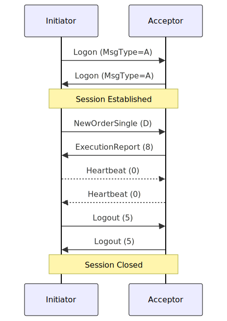
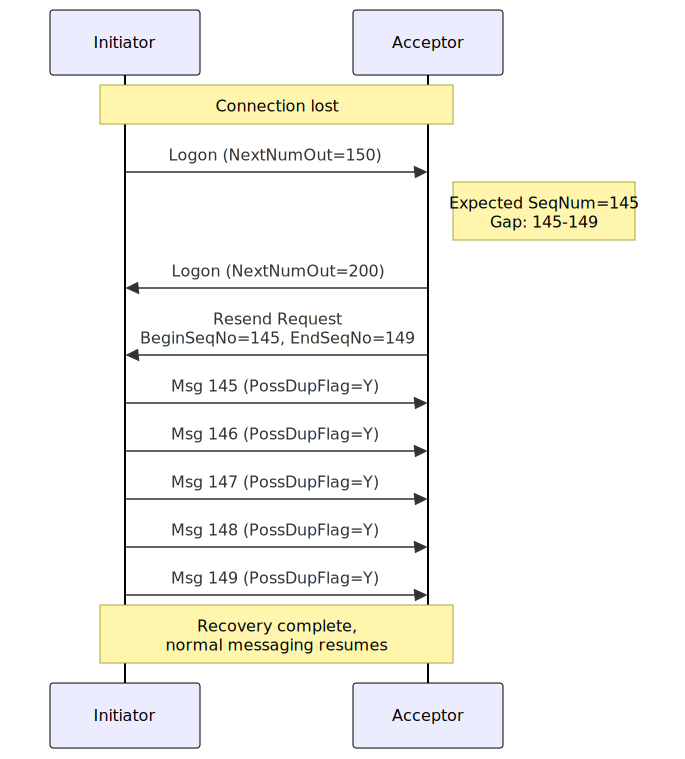

If you've ever wondered how trading systems communicate, the answer is usually FIX.

The Financial Information eXchange (FIX) protocol is the lingua franca of electronic trading. Every major exchange, broker, and trading platform speaks it. When you place an order through your broker, there's a good chance FIX messages are flowing somewhere in the chain.

This article explains what FIX is, how it works, and shows a practical Go implementation that connects to Binance's FIX API.

## A Brief History

In 1992, Fidelity Investments had a problem. Their traders were communicating with Salomon Brothers over the phone. Orders got lost. Information went to the wrong trader. When people hung up, context disappeared.

Robert Lamoureux and Chris Morstatt at Fidelity created FIX to solve this. Instead of voice, they wanted machine-readable data.

```
1992: FIX 2.7 - Initial release (Fidelity + Salomon Brothers)
1995: FIX 4.0 - First public version
1998: FIX 4.2 - Most widely adopted version
2001: FIX 4.3 - Added fixed income support
2003: FIX 4.4 - Enhanced market data
2006: FIX 5.0 - Split session/application layers
2024: FIX still going strong
```

Today, FIX is managed by FIX Trading Community, a non-profit with over 300 member firms. It's an open standard—no licensing fees, no vendor lock-in.

## Why FIX Matters

FIX dominates because it solves real problems:

**Standardization**: Before FIX, every broker had a proprietary protocol. Connecting to 10 brokers meant maintaining 10 different integrations. With FIX, you implement once and connect to everyone.

**Reliability**: FIX includes sequence numbers, heartbeats, and message recovery. If a connection drops, both sides know exactly which messages need to be resent.

**Completeness**: FIX covers the entire trade lifecycle:

- Pre-trade: quotes, market data, indications of interest
- Trade: orders, executions, cancellations
- Post-trade: allocations, confirmations, settlement

**Performance**: Despite being text-based, FIX is fast enough for most trading. For ultra-low latency, there's FAST (FIX Adapted for STreaming) and SBE (Simple Binary Encoding).

## Protocol Architecture

FIX operates on two layers:



**Session Layer**: Handles connection management, authentication, message sequencing, and recovery. This is what keeps the conversation reliable.

**Application Layer**: The actual business messages—orders, executions, market data. This is what traders care about.

Starting with FIX 5.0, these layers were formally separated into FIXT (session) and FIX (application), allowing different application versions over the same session protocol.

## Message Structure

Every FIX message follows the same pattern:

```
Header + Body + Trailer
```

Fields are `tag=value` pairs separated by the SOH character (ASCII 0x01, often shown as `|` or `^`).

### A Real Message

Here's a New Order Single (buying 7000 shares of MSFT):

```
8=FIX.4.4|9=148|35=D|34=1080|49=TESTBUY1|52=20180920-18:14:19.508|
56=TESTSELL1|11=636730640278898634|15=USD|21=2|38=7000|40=1|54=1|
55=MSFT|60=20180920-18:14:19.492|10=092|
```

Let's break it down:

### Header Fields (Required)

| Tag | Name         | Value                 | Meaning                    |
| --- | ------------ | --------------------- | -------------------------- |
| 8   | BeginString  | FIX.4.4               | Protocol version           |
| 9   | BodyLength   | 148                   | Message body size in bytes |
| 35  | MsgType      | D                     | New Order Single           |
| 34  | MsgSeqNum    | 1080                  | Sequence number            |
| 49  | SenderCompID | TESTBUY1              | Who's sending              |
| 52  | SendingTime  | 20180920-18:14:19.508 | When it was sent           |
| 56  | TargetCompID | TESTSELL1             | Who should receive         |

### Body Fields (Message-Specific)

| Tag | Name         | Value                 | Meaning             |
| --- | ------------ | --------------------- | ------------------- |
| 11  | ClOrdID      | 636730640278898634    | Client's order ID   |
| 15  | Currency     | USD                   | Currency            |
| 21  | HandlInst    | 2                     | Automated execution |
| 38  | OrderQty     | 7000                  | Quantity            |
| 40  | OrdType      | 1                     | Market order        |
| 54  | Side         | 1                     | Buy                 |
| 55  | Symbol       | MSFT                  | Instrument          |
| 60  | TransactTime | 20180920-18:14:19.492 | Transaction time    |

### Trailer (Required)

| Tag | Name     | Value | Meaning                        |
| --- | -------- | ----- | ------------------------------ |
| 10  | CheckSum | 092   | Simple checksum for validation |

The checksum is calculated as: `sum of all bytes % 256`, formatted as 3 digits.

## Key Message Types

FIX defines dozens of message types. Here are the essential ones:

### Session Messages

| MsgType | Name           | Purpose                 |
| ------- | -------------- | ----------------------- |
| A       | Logon          | Initiate session        |
| 5       | Logout         | Terminate session       |
| 0       | Heartbeat      | Keep-alive              |
| 1       | Test Request   | Verify connection       |
| 2       | Resend Request | Request missed messages |
| 4       | Sequence Reset | Reset sequence numbers  |
| 3       | Reject         | Session-level rejection |

### Application Messages

| MsgType | Name                    | Purpose             |
| ------- | ----------------------- | ------------------- |
| D       | New Order Single        | Submit a new order  |
| F       | Order Cancel Request    | Cancel an order     |
| G       | Order Cancel/Replace    | Modify an order     |
| 8       | Execution Report        | Order status/fill   |
| 9       | Order Cancel Reject     | Cancel failed       |
| V       | Market Data Request     | Subscribe to quotes |
| W       | Market Data Snapshot    | Full book snapshot  |
| X       | Market Data Incremental | Book updates        |

## Session Management

FIX sessions are stateful. Both sides maintain sequence numbers and can recover from failures.

### Session Lifecycle



### Sequence Numbers

Every message has a sequence number (tag 34). Both sides track:

- **NextNumOut**: Next sequence number to send
- **NextNumIn**: Next sequence number expected

If you receive MsgSeqNum 100 but expected 95, there's a gap. The receiver sends a Resend Request and the sender retransmits the missing messages:


### Heartbeats

During idle periods, both sides send Heartbeat messages at a configured interval (typically 30 seconds). This:

1. Proves the connection is alive
2. Allows gap detection even during quiet periods

If no Heartbeat arrives within `HeartBtInt + reasonable_delta`, the connection is considered dead.

### Message Recovery

When reconnecting after a failure, both sides exchange sequence numbers and retransmit anything the other side missed:



The initiator sends a Logon with its current sequence number. The acceptor compares it against what it expects, detects the gap, and requests the missing messages. All retransmitted messages are flagged with PossDupFlag=Y so the receiver knows they're replays.

This is why FIX can survive network failures without losing orders.

## Important Tags Reference

### Order Tags

| Tag | Name        | Description                         |
| --- | ----------- | ----------------------------------- |
| 1   | Account     | Trading account                     |
| 11  | ClOrdID     | Client order ID (your reference)    |
| 37  | OrderID     | Exchange order ID (their reference) |
| 38  | OrderQty    | Order quantity                      |
| 40  | OrdType     | 1=Market, 2=Limit, 3=Stop, etc.     |
| 44  | Price       | Limit price                         |
| 54  | Side        | 1=Buy, 2=Sell, 5=Short              |
| 55  | Symbol      | Instrument symbol                   |
| 59  | TimeInForce | 0=Day, 1=GTC, 3=IOC, 4=FOK          |

### Execution Report Tags

| Tag | Name      | Description                                            |
| --- | --------- | ------------------------------------------------------ |
| 6   | AvgPx     | Average fill price                                     |
| 14  | CumQty    | Cumulative filled quantity                             |
| 17  | ExecID    | Execution ID                                           |
| 31  | LastPx    | Last fill price                                        |
| 32  | LastQty   | Last fill quantity                                     |
| 39  | OrdStatus | 0=New, 1=PartialFill, 2=Filled, 4=Canceled, 8=Rejected |
| 150 | ExecType  | What happened (0=New, F=Trade, 4=Canceled, etc.)       |
| 151 | LeavesQty | Remaining quantity                                     |

### Execution Report Example

```
8=FIX.4.4|9=289|35=8|34=1090|49=TESTSELL1|52=20180920-18:23:53.671|
56=TESTBUY1|6=113.35|11=636730640278898634|14=3500|15=USD|17=20636730646335310000|
21=2|31=113.35|32=3500|37=20636730646335310000|38=7000|39=1|40=1|54=1|55=MSFT|
60=20180920-18:23:53.531|150=F|151=3500|10=151|
```

This says: Your 7000-share MSFT order (tag 11) is partially filled (tag 39=1). 3500 shares executed at $113.35 (tags 32, 31). 3500 shares remain (tag 151).

## User-Defined Tags

Tags 5000-9999 (and 20000-39999 in newer versions) are reserved for custom fields. Trading partners can agree on their own meanings:

```
8=FIX.4.4|...|5001=INTERNAL_STRATEGY_7|5002=URGENT|...
```

This allows firms to extend FIX without breaking compatibility.

## Repeating Groups

Some data needs to repeat—like multiple legs of a spread order or multiple parties to a trade.

Repeating groups start with a count field, followed by the repeated fields:

```
453=2|                    ← Number of parties (NoPartyIDs)
  448=BROKER1|447=D|452=1|  ← Party 1
  448=TRADER1|447=D|452=11| ← Party 2
```

Rules:

1. Count field comes first
2. Fields within a group must maintain consistent order
3. The first field of each instance identifies the group boundary

## FIXML: The XML Alternative

FIX also has an XML format:

```xml
<FIXML>
  <Order ClOrdID="12345" Side="1" OrdTyp="2" Px="100.50">
    <Instrmt Sym="MSFT"/>
    <OrdQty Qty="1000"/>
  </Order>
</FIXML>
```

FIXML is:

- More verbose (larger messages)
- Easier to validate (XML Schema)
- Better for complex, nested structures
- Popular in post-trade processing

Tag=value remains dominant for real-time trading due to size and parsing speed.

## Practical Example: Binance FIX API in Go

Theory is nice, but FIX clicks when you see it in action. Let's build a client that connects to Binance's FIX API on testnet, subscribes to market data, places limit orders, and queries open orders.

We'll use [QuickFIX/Go](https://github.com/quickfixgo/quickfix) — the Go port of the popular QuickFIX engine. It handles session management, heartbeats, sequencing, and TLS out of the box.

Binance exposes two FIX sessions:

| Session     | Host                            | Port |
| ----------- | ------------------------------- | ---- |
| Order Entry | `fix-oe.testnet.binance.vision` | 9000 |
| Market Data | `fix-md.testnet.binance.vision` | 9000 |

Both use FIX 4.4 with `TargetCompID=SPOT` and require Ed25519 authentication.

### Authentication

Binance doesn't use the standard FIX Logon fields for auth. Instead, you sign a payload with your Ed25519 private key and stuff the signature into the Logon message.

The signature payload is five fields joined by SOH:

```
MsgType(A) | SenderCompID | TargetCompID | MsgSeqNum | SendingTime
```

```go
package main

import (
    "crypto/ed25519"
    "encoding/base64"
    "fmt"
)

func SignLogon(senderCompID, targetCompID string,
    seqNum int, sendingTime string,
    privateKey ed25519.PrivateKey) string {

    payload := fmt.Sprintf("A\x01%s\x01%s\x01%d\x01%s",
        senderCompID, targetCompID, seqNum, sendingTime)
    sig := ed25519.Sign(privateKey, []byte(payload))
    return base64.StdEncoding.EncodeToString(sig)
}
```

The signature goes into `RawData(96)`, and your API key into both `SenderCompID(49)` (set via QuickFIX config) and `Username(553)`.

### Injecting Auth into Logon

QuickFIX calls `ToAdmin()` on every outgoing admin message. We intercept Logon (MsgType=A) and inject the signature:

```go
func (app *OrderEntryApp) ToAdmin(msg *quickfix.Message,
    sessionID quickfix.SessionID) {

    msgType, _ := msg.Header.GetString(quickfix.Tag(35))
    if msgType != "A" {
        return
    }

    seqNum, _ := msg.Header.GetInt(quickfix.Tag(34))
    sendingTime, _ := msg.Header.GetString(quickfix.Tag(52))

    sig := SignLogon(app.apiKey, "SPOT", seqNum,
        sendingTime, app.privateKey)

    msg.Body.SetString(quickfix.Tag(553), app.apiKey) // Username
    msg.Body.SetInt(quickfix.Tag(95), len(sig))       // RawDataLength
    msg.Body.SetString(quickfix.Tag(96), sig)         // RawData
    msg.Body.SetString(quickfix.Tag(141), "Y")        // ResetSeqNumFlag
    msg.Body.SetInt(quickfix.Tag(25035), 2)           // MessageHandling
}
```

Both the Market Data and Order Entry sessions use the same pattern — the only difference is what messages flow through `FromApp()`.

### Subscribing to Market Data

To get best bid/offer for a symbol, send a `MarketDataRequest(V)` with `MarketDepth=1`:

```go
func (app *MarketDataApp) SubscribeBookTicker(symbol string) error {
    msg := quickfix.NewMessage()
    msg.Header.SetString(quickfix.Tag(35), "V") // MarketDataRequest

    msg.Body.SetString(quickfix.Tag(262), "mdreq_"+symbol)
    msg.Body.SetString(quickfix.Tag(263), "1") // Subscribe
    msg.Body.SetString(quickfix.Tag(264), "1") // MarketDepth = top of book

    // Which symbol
    symbolGroup := quickfix.NewRepeatingGroup(quickfix.Tag(146),
        quickfix.GroupTemplate{quickfix.GroupElement(quickfix.Tag(55))})
    row := symbolGroup.Add()
    row.SetString(quickfix.Tag(55), symbol)
    msg.Body.SetGroup(symbolGroup)

    // Which data: bid + offer
    entryGroup := quickfix.NewRepeatingGroup(quickfix.Tag(267),
        quickfix.GroupTemplate{quickfix.GroupElement(quickfix.Tag(269))})
    entryGroup.Add().SetString(quickfix.Tag(269), "0") // Bid
    entryGroup.Add().SetString(quickfix.Tag(269), "1") // Offer
    msg.Body.SetGroup(entryGroup)

    return quickfix.SendToTarget(msg, app.sessionID)
}
```

Binance responds with `MarketDataSnapshotFullRefresh(W)` messages, which we parse in `FromApp()`:

```go
func (app *MarketDataApp) FromApp(msg *quickfix.Message,
    sessionID quickfix.SessionID) quickfix.MessageRejectError {

    msgType, _ := msg.Header.GetString(quickfix.Tag(35))
    if msgType == "W" {
        symbol, _ := msg.Body.GetString(quickfix.Tag(55))

        group := quickfix.NewRepeatingGroup(quickfix.Tag(268),
            quickfix.GroupTemplate{
                quickfix.GroupElement(quickfix.Tag(269)), // MDEntryType
                quickfix.GroupElement(quickfix.Tag(270)), // MDEntryPx
                quickfix.GroupElement(quickfix.Tag(271)), // MDEntrySize
            })

        if err := msg.Body.GetGroup(group); err == nil {
            for i := 0; i < group.Len(); i++ {
                entry := group.Get(i)
                entryType, _ := entry.GetString(quickfix.Tag(269))
                price, _ := entry.GetString(quickfix.Tag(270))
                size, _ := entry.GetString(quickfix.Tag(271))

                side := "BID"
                if entryType == "1" {
                    side = "ASK"
                }
                fmt.Printf("%s %s price=%s size=%s\n",
                    symbol, side, price, size)
            }
        }
    }
    return nil
}
```

### Placing Orders

A limit order is a `NewOrderSingle(D)`:

```go
func (app *OrderEntryApp) PlaceLimitOrder(
    symbol, side, qty, price string) (string, error) {

    clOrdID := strconv.FormatInt(time.Now().UnixNano(), 10)

    fixSide := "1" // BUY
    if side == "sell" {
        fixSide = "2"
    }

    msg := quickfix.NewMessage()
    msg.Header.SetString(quickfix.Tag(35), "D") // NewOrderSingle

    msg.Body.SetString(quickfix.Tag(11), clOrdID) // ClOrdID
    msg.Body.SetString(quickfix.Tag(55), symbol)  // Symbol
    msg.Body.SetString(quickfix.Tag(54), fixSide) // Side
    msg.Body.SetString(quickfix.Tag(38), qty)     // OrderQty
    msg.Body.SetString(quickfix.Tag(40), "2")     // OrdType = LIMIT
    msg.Body.SetString(quickfix.Tag(44), price)   // Price
    msg.Body.SetString(quickfix.Tag(59), "1")     // TimeInForce = GTC

    return clOrdID, quickfix.SendToTarget(msg, app.sessionID)
}
```

Binance responds with `ExecutionReport(8)`. We parse key fields to track order status:

```go
func (app *OrderEntryApp) handleExecutionReport(msg *quickfix.Message) {
    clOrdID, _ := msg.Body.GetString(quickfix.Tag(11))
    symbol, _ := msg.Body.GetString(quickfix.Tag(55))
    ordStatus, _ := msg.Body.GetString(quickfix.Tag(39))
    price, _ := msg.Body.GetString(quickfix.Tag(44))
    qty, _ := msg.Body.GetString(quickfix.Tag(38))
    leavesQty, _ := msg.Body.GetString(quickfix.Tag(151))

    status := map[string]string{
        "0": "NEW", "1": "PARTIAL", "2": "FILLED",
        "4": "CANCELED", "8": "REJECTED",
    }[ordStatus]

    fmt.Printf("ExecReport: %s %s qty=%s price=%s status=%s leaves=%s id=%s\n",
        symbol, status, qty, price, status, leavesQty, clOrdID)
}
```

### Listing Open Orders

`OrderMassStatusRequest(AF)` with `MassStatusReqType=7` returns execution reports for all active orders:

```go
func (app *OrderEntryApp) QueryOpenOrders(symbol string) error {
    msg := quickfix.NewMessage()
    msg.Header.SetString(quickfix.Tag(35), "AF")

    msg.Body.SetString(quickfix.Tag(584),
        strconv.FormatInt(time.Now().UnixNano(), 10)) // MassStatusReqID
    msg.Body.SetString(quickfix.Tag(585), "7")        // All orders
    msg.Body.SetString(quickfix.Tag(55), symbol)      // Symbol

    return quickfix.SendToTarget(msg, app.sessionID)
}
```

Binance responds with one `ExecutionReport(8)` per open order, which flows into the same `handleExecutionReport` handler above.

### Canceling Orders

```go
func (app *OrderEntryApp) CancelOrder(symbol, origClOrdID string) error {
    msg := quickfix.NewMessage()
    msg.Header.SetString(quickfix.Tag(35), "F") // OrderCancelRequest

    msg.Body.SetString(quickfix.Tag(11),
        strconv.FormatInt(time.Now().UnixNano(), 10)) // ClOrdID
    msg.Body.SetString(quickfix.Tag(41), origClOrdID) // OrigClOrdID
    msg.Body.SetString(quickfix.Tag(55), symbol)      // Symbol
    msg.Body.SetString(quickfix.Tag(54), "1")         // Side (required)

    return quickfix.SendToTarget(msg, app.sessionID)
}
```

### Putting It Together

The main function creates two QuickFIX initiators — one for market data, one for order entry — and starts a CLI loop:

```go
func main() {
    apiKey := os.Getenv("BINANCE_FIX_API_KEY")
    privKey, _ := LoadEd25519Key(os.Getenv("BINANCE_FIX_PRIVATE_KEY"))

    mdApp := NewMarketDataApp(apiKey, privKey)
    mdInitiator, _ := createInitiator(mdApp,
        "configs/market_data.cfg", apiKey)

    oeApp := NewOrderEntryApp(apiKey, privKey)
    oeInitiator, _ := createInitiator(oeApp,
        "configs/order_entry.cfg", apiKey)

    mdInitiator.Start()
    defer mdInitiator.Stop()
    oeInitiator.Start()
    defer oeInitiator.Stop()

    // Wait for both sessions to log on, then subscribe
    mdApp.SubscribeBookTicker("BTCUSDT")

    // CLI: buy 0.001 50000 | sell 0.001 60000 | orders | cancel <id>
    scanner := bufio.NewScanner(os.Stdin)
    for scanner.Scan() {
        parts := strings.Fields(scanner.Text())
        switch parts[0] {
        case "buy", "sell":
            oeApp.PlaceLimitOrder("BTCUSDT", parts[0], parts[1], parts[2])
        case "orders":
            oeApp.QueryOpenOrders("BTCUSDT")
        case "cancel":
            oeApp.CancelOrder("BTCUSDT", parts[1])
        }
    }
}
```

QuickFIX session config (`configs/order_entry.cfg`):

```ini
[DEFAULT]
ConnectionType=initiator
HeartBtInt=30
SocketConnectHost=fix-oe.testnet.binance.vision
SocketConnectPort=9000
SocketUseSSL=Y
ResetOnLogon=Y

[SESSION]
BeginString=FIX.4.4
SenderCompID=PLACEHOLDER
TargetCompID=SPOT
```

`SenderCompID` gets overridden at runtime with the API key. Market data config is identical except the host points to `fix-md.testnet.binance.vision`.

To run: generate an Ed25519 API key on [Binance Testnet](https://testnet.binance.vision/), set `BINANCE_FIX_API_KEY` and `BINANCE_FIX_PRIVATE_KEY` (base64-encoded 32-byte seed), and go.

## Testing and Debugging

### FIX Log Format

For readability, replace SOH with `|`:

```bash
# Convert FIX logs for viewing
sed 's/\x01/|/g' fix.log
```

### FIX Analyzers

- **FIX Antenna Log Viewer**: GUI for analyzing FIX logs
- **Wireshark**: Has FIX protocol dissector
- **fixspec.com**: Online FIX message decoder

### Simulators

For testing without a real exchange:

- **QuickFIX Executor**: Simple order matching engine
- **fix-simple-server**: Minimal FIX acceptor for testing
- **FIXimulator**: Full-featured exchange simulator

## Beyond FIX: Related Protocols

FIX has spawned several related standards:

**FAST** (FIX Adapted for STreaming): Binary encoding for market data. 10-20x smaller than FIX.

**SBE** (Simple Binary Encoding): Modern binary format used by CME, Binance. Even faster than FAST.

**FpML** (Financial products Markup Language): XML-based protocol for OTC derivatives.

## References

### Official Documentation

- [FIX Trading Community](https://www.fixtrading.org/) - Official FIX specifications
- [FIX Beginners Guide](https://www.fixtrading.org/beginners-resources/) - Official learning resources
- [OnixS FIX Dictionary](https://www.onixs.biz/fix-dictionary.html) - Complete tag reference
- [FIX Protocol Wikipedia](https://en.wikipedia.org/wiki/Financial_Information_eXchange)

### Tutorials & Articles

- [FIXSIM Tutorial](https://www.fixsim.com/fix-protocol-tutorial) - Comprehensive FIX tutorial
- [Habr: FIX Protocol (RU)](https://habr.com/ru/companies/iticapital/articles/242789/) - Russian introduction
- [Habr: Trading with FIX (RU)](https://habr.com/ru/articles/503916/) - Practical setup guide
- [Habr: FAST Protocol (RU)](https://habr.com/ru/articles/827330/) - FIX streaming extension
- [FIX Message Samples](https://www.fixsim.com/sample-fix-messages) - Example messages
