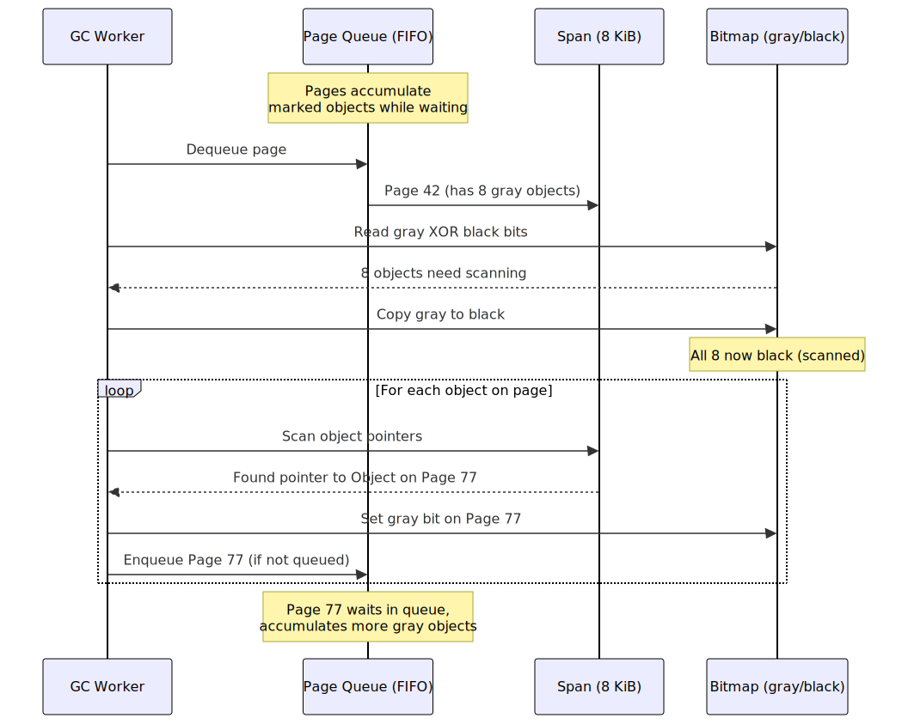

Go's garbage collector has a dirty secret: over 85% of its CPU time is spent in a single loop — the mark phase scan loop. And more than a third of _that_ time is wasted stalling on memory.

Not because the algorithm is wrong. Because the CPU cache can't keep up.

Go 1.26 ships [Green Tea](https://go.dev/blog/greenteagc) as the default garbage collector. It changes one fundamental thing about how marking works, and that one change cuts GC overhead by 10-40% depending on your workload.

## What's Wrong With the Current GC

Go uses a [concurrent, tri-color mark-sweep collector](https://go.dev/blog/ismmkeynote). During the mark phase, it traverses the heap as a graph: objects are nodes, pointers are edges. Starting from root objects (stack variables, globals), it follows every pointer, marking each reachable object as "alive."

The problem isn't the algorithm — it's the access pattern.

When the collector dequeues an object from its work list, it reads that object's memory to find pointers to other objects. Those other objects live somewhere else in the heap. The collector jumps there, reads that memory, finds more pointers, jumps again.

Each jump is likely a cache miss. The heap is large — gigabytes in production services. The objects you're jumping between are scattered across different memory pages. The CPU's L1 cache is 32-64 KB. L2 is 256 KB-1 MB. Your heap is 2 GB.

The result: **35% of all CPU cycles in the mark phase are stalled waiting for memory.** The processor sits idle while data loads from L3 or main RAM.

The existing collector uses a LIFO stack (depth-first traversal). This makes locality worse — each dequeued object is likely far from the previous one. The CPU prefetcher can't help because there's no predictable pattern.

## How Green Tea Fixes It

The difference between the two approaches comes down to what sits in the work queue:



The old collector jumps between random pages chasing individual object pointers. Green Tea batches objects by page and scans them contiguously.

Green Tea makes one structural change: **the work list contains memory pages, not objects.**

Instead of tracking individual objects, the collector tracks 8 KiB spans — contiguous chunks of memory that hold same-sized objects. When a goroutine scanning the heap finds a pointer to an object, it marks that object within its span and enqueues the entire span (if not already queued).

The key insight: while a span sits in the queue waiting to be processed, more objects on that same span may get marked. By the time a worker dequeues the span, there may be 5, 10, or 50 objects to scan — all adjacent in memory, all fitting in the same cache lines.

### The Algorithm Step by Step

The full cycle — from dequeuing a page to enqueuing newly discovered pages — looks like this:



Each object gets two metadata bits:

| Gray | Black | Meaning                             |
| ---- | ----- | ----------------------------------- |
| 0    | 0     | White — unreached, possibly garbage |
| 1    | 0     | Gray — found, waiting to be scanned |
| 1    | 1     | Black — scanned, definitely alive   |

When a worker dequeues a span:

1. **Compute the difference** between gray and black bits — this identifies objects that need scanning (gray but not yet black)
2. **Copy gray bits to black bits** — mark everything as scanned
3. **Scan each identified object** — read its memory, follow pointers, set gray bits on target objects in their respective spans

Because all objects in a span have the same size and are laid out contiguously, scanning them is a sequential memory sweep — exactly what CPU prefetchers are designed to accelerate.

### FIFO, Not LIFO

The existing GC uses a LIFO stack (depth-first). Green Tea uses a FIFO queue (breadth-first).

Why? FIFO gives spans more time to accumulate marked objects. If you immediately process a span after one object is marked (LIFO behavior), you scan that one object, miss the other 49 on the same span that would have been marked a few microseconds later, and have to re-enqueue the span when those objects are found.

FIFO lets spans "ripen." By the time a span reaches the front of the queue, it typically has more objects marked — more work per cache-friendly sweep.

### Single-Object Optimization

Not every span accumulates multiple objects. In pathological cases — deeply linked trees, sparse heaps — a span might have only one marked object when dequeued.

Green Tea handles this with a fast path: it tracks the first marked object as a "representative" and sets a "hit" flag when a second object on the same span is marked. If the hit flag is never set, the worker skips the bitmap scan and directly processes the single object — no overhead over the old algorithm.

## AVX-512: Hardware-Accelerated Scanning

On CPUs with AVX-512 support (Intel Ice Lake+, AMD Zen 4+), Green Tea uses vector instructions to process entire spans in a few cycles.

The idea: a span's metadata bitmap fits in a 512-bit register. A single `VPTESTMD` instruction can compute gray-but-not-black objects for an entire span. A permute instruction can gather pointers from those objects in parallel.

This gives an additional ~10% reduction in GC overhead on top of the base Green Tea improvement. Go 1.25 shipped without this; Go 1.26 includes it.

The significance isn't just the speedup. The old per-object scanning loop had irregular memory access — SIMD was fundamentally impossible. By switching to page-level scanning, the Go team made the access pattern regular enough for vector hardware to help. **The data structure change enabled the hardware optimization.**

## What the Numbers Look Like

From the Go team's benchmarks and community reports:

**Where Green Tea helps:**

- GC-heavy microbenchmarks: 10-50% reduction in GC CPU time
- tile38 (geospatial database): 35% reduction in GC overhead
- L1/L2 cache misses during GC: cut in half
- Programs spending 10% of CPU in GC: 1-4% total CPU savings
- With AVX-512: additional ~10% on top

**Where it doesn't help:**

- [DoltHub](https://www.dolthub.com/blog/2025-09-26-greentea-gc-with-dolt/) (SQL database engine): no measurable improvement, slight regression in mark time
- bleve-index (search indexer): "performance is a wash" — low-fanout binary tree with frequent rotations scatters objects across spans, Green Tea scans single objects per span most of the time
- Programs with minimal GC pressure: no change (you can't optimize what isn't running)

The Go team is direct about this: **"Green Tea has good locality when the application itself has good locality. It can't create locality out of nothing."**

If your heap is a large graph of tiny objects with no spatial correlation — each object on a different page — Green Tea reverts to essentially the same performance as the old collector. The single-object optimization prevents regression, but there's nothing to gain.

## When Green Tea Matters for Your Code

Green Tea helps most when:

- **Your service has significant GC pressure** — check with `GODEBUG=gctrace=1` or `runtime/metrics`. If GC is <5% of CPU, the improvement is negligible
- **Your heap has spatial locality** — objects allocated together tend to reference each other. This is the common case for request-scoped allocations, protobufs, JSON structs, and most business logic
- **You're running on modern hardware** — AVX-512 capable CPUs get the biggest win

Green Tea helps less when:

- **Your heap is a sparse graph** — tree structures with nodes scattered across the heap won't benefit much
- **You've already minimized allocations** — if you've done the work to make objects stack-allocated or pooled, there's less heap for the GC to scan
- **Your bottleneck is sweep, not mark** — Green Tea only changes marking. The 10% of GC time spent sweeping is unaffected

## How to Use It

In Go 1.26, Green Tea is the default. You don't need to do anything.

To opt out (this escape hatch is removed in Go 1.27):

```bash
GOEXPERIMENT=nogreenteagc go build ./...
```

To measure the difference on your workload:

```bash
# Build with and without Green Tea
GOEXPERIMENT=nogreenteagc go test -bench=. -benchmem ./... > old.txt
go test -bench=. -benchmem ./... > new.txt
benchstat old.txt new.txt

# Or check GC traces directly
GODEBUG=gctrace=1 ./your-service 2>&1 | grep 'gc '
```

Look at the `@` field in gctrace output — that's the percentage of CPU used by GC. Compare it between builds.

## What It Means for Go's Runtime

Green Tea is the first major GC algorithm change since [Go 1.5 introduced the concurrent collector](https://go.dev/blog/go15gc) in 2015. The design philosophy is worth noting: instead of a fundamentally different collection strategy (generational, regional, compacting), the Go team kept the same mark-sweep foundation and changed _how_ it traverses memory.

That's a very Go approach. The same algorithm, but aware of the hardware it runs on.

The broader implication: Go's runtime is increasingly shaped by CPU cache behavior. Green Tea for the GC, `CacheLinePad` for false sharing, struct layout affecting allocation patterns — understanding cache lines is no longer optional knowledge for performance-sensitive Go code.

## References

- [The Green Tea Garbage Collector](https://go.dev/blog/greenteagc) — official Go blog post by Michael Knyszek and Austin Clements
- [runtime: green tea garbage collector](https://github.com/golang/go/issues/73581) — GitHub tracking issue with full design details
- [Getting to Go: The Journey of Go's Garbage Collector](https://go.dev/blog/ismmkeynote) — history of Go's GC from Rick Hudson's 2018 keynote
- [Go GC: Prioritizing low latency and simplicity](https://go.dev/blog/go15gc) — the Go 1.5 concurrent GC introduction
- [We tried Green Tea GC and it didn't help](https://www.dolthub.com/blog/2025-09-26-greentea-gc-with-dolt/) — DoltHub's real-world experience with Green Tea
- [Go 1.26 Release Notes](https://go.dev/doc/go1.26) — official release notes
